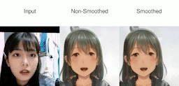

# Parsing-Conditioned Anime Translation: A New Dataset and Method(ACM TOG)
[paper](https://dl.acm.org/doi/pdf/10.1145/3585002)
> Anime is an abstract art form that is substantially different from the human portrait, leading to a challenging misaligned image translation problem that is beyond the capability of existing methods. This can be boiled down to a highly ambiguous unconstrained translation between two domains. To this end, we design a new anime translation framework by deriving the prior knowledge of a pre-trained StyleGAN model. We introduce disentangled encoders to separately embed structure and appearance information into the same latent code, governed by four tailored losses. Moreover, we develop a FaceBank aggregation method that leverages the generated data of the StyleGAN, anchoring the prediction to, produce in-domain animes. To empower our model and promote the research of anime translation, we propose the first anime portrait parsing dataset, Danbooru-Parsing, containing 4,921 densely labeled images across 17 classes. This dataset connects the face semantics with appearances, enabling our new constrained translation setting. We further show the editability of our results, and extend our method to manga images, by generating the first manga parsing pseudo data. Extensive experiments demonstrate the values of our new dataset and method, resulting in the first feasible solution on anime translation.


 
<br>

# Description
This is the official implementation of our paper "Parsing-Conditioned Anime Translation: A New Dataset and Method"(ACM TOG).

# Danbooru-Parsing Dataset
We train anime parsing model with [face-parsing](https://github.com/zllrunning/face-parsing.PyTorch), and the well trained model can be downloaded [here](https://drive.google.com/file/d/1NhvfYmr9grvHw5lFCfNukurB-Sft-Jvo/view?usp=share_link).
|Label List| | |
|-------|------|------|
|0:'background'|1:'skin'|2:'l_brow'|
|3:'r_brow'|4:'l_eye'|5:'r_eye'|
|6:'eye_g'|7:'l_ear'|8:'r_ear'|
|9:'ear_r'|10:'nose'|11:'mouth'|
|12:'u_lip'|13:'l_lip'|14:'neck'|
|15:'neck_l'|16:'cloth'|17:'hair'|
|18:'hat'| | |

  
 
 [Danbooru-Parsing Dataset](https://drive.google.com/file/d/13C7Jphi8dYkY_0HoqIZeXAIkppyKlzmQ/view?usp=share_link)
 
 

# Pretrained Models
Please download the pre-trained models from the following links.  
      Path     |    Description      |  
|----------------|--------------------|
| [IR-SE50 Model](https://drive.google.com/file/d/1b7d9xyvUm1y2xxMyX_LTy9UgamVf563F/view?usp=sharing) |Pretrained IR-SE50 model taken from [TreB1eN](https://github.com/TreB1eN/InsightFace_Pytorch) for use in our ID loss during pSp training.| 
| [MTCNN](https://drive.google.com/file/d/1w46525L0FvoCzcVZpuiXVfMzmyOO_3A2/view?usp=sharing) | Weights for [MTCNN](https://github.com/TreB1eN/InsightFace_Pytorch) model taken from TreB1eN for use in ID similarity metric computation. (Unpack the tar.gz to extract the 3 model weights.)|
|[CurricularFace Backbone](https://drive.google.com/file/d/1y5Y7ZVZNd9UAqVkXnGwl9NK10SUUjsr4/view?usp=share_link) | Pretrained CurricularFace model taken from [HuangYG123](https://github.com/HuangYG123/CurricularFace) for use in ID similarity metric computation.| 
| [Anime StyleGAN2 Model](https://drive.google.com/file/d/1aYaEx-_sqBrI_KH98s3yc1KZFXQCGm9R/view?usp=share_link) | Finetuned model of StyleGAN2 on our anime dataset with StyleGAN2, code from [rosinality](https://github.com/rosinality/stylegan2-pytorch) | 
| [Average Latent](https://drive.google.com/file/d/1Zq9Q-nUf0wz71Q_shvAg8c42KIO3LLav/view?usp=share_link) | Average latent of Stylegan2 pretrained model on anime | 
| [Bank list](https://drive.google.com/file/d/1aho_17m0rZxxj88SCg-NAIfJXMJNaEZs/view?usp=share_link) | FaceBank Aggregation, stylegan2 anime latent list|
| [StyleAnime](https://drive.google.com/file/d/1zresf1KfX1keJT2dv0jZesDppWLQXYNa/view?usp=share_link)   | Our pretrained styleAnime model (portrait2anime)|  


The pretrained models should be saved to the directory pretrained_models.

# Preparing Data
Please first download training dataset:
	[anime](https://drive.google.com/file/d/13C7Jphi8dYkY_0HoqIZeXAIkppyKlzmQ/view?usp=share_link)
	[celeba](https://drive.google.com/file/d/1wwKrufFxZjhTDDm-eHD6Ent2Kc-gOHs7/view?usp=share_link)
	

Then go to configs/paths_config.py and define:
```
dataset_paths = {
	'anime_train_segmentation': 'path/anime/anime_seg_train',
	'anime_test_segmentation': 'path/anime/anime_seg_test_68',
	'anime_train': 'path/anime/anime_face_train',
	'anime_test': 'path/anime_face_test_68',
    
	'face_train_segmentation': 'path/celeba/celeba_seg_train',
	'face_test_segmentation': 'path/celeba/celeba_seg_test_68',
	'face_train': 'path/celeba/celeba_face_train',
	'face_test': 'path/celeba/celeba_face_test_68',
}
model_paths = {
	'anime_ffhq': 'pretrained_models/stylegan2_anime_pretrained.pt',
	'ir_se50': 'pretrained_models/model_ir_se50.pth',
	'circular_face': 'pretrained_models/CurricularFace_Backbone.pth',
	'mtcnn_pnet': 'pretrained_models/mtcnn/pnet.npy',
	'mtcnn_rnet': 'pretrained_models/mtcnn/rnet.npy',
	'mtcnn_onet': 'pretrained_models/mtcnn/onet.npy',
}
```
# Training
The main training script can be found in ```scripts/train.py.```
```
python scripts/train.py
--exp_dir=/path/output
--batch_size=1
--val_interval=2500
--save_interval=5000 
--encoder_type=GradualStyleEncoder
--start_from_latent_avg
--learning_rate=0.0001 
--lpips_lambda=2 --l2_lambda=2.5 
--hm_lambda=0.1
--w_norm_lambda=0.005
--w_norm_lambda_1=0.005
--loss_adv_weight=0.1 
--loss_adv_weight_latent=0.1 
--label_nc=19 
--input_nc=19
--test_batch_size=1
```
# Testing
```
python scripts/inference_latent.py --exp_dir=/path/portrait2anime_results --checkpoint_path=./pretrained_models/best_model.pt --test_batch_size=1
```
We assume that all pretrained models are downloaded and saved to the directory ```pretrained_models```.

# Acknowledgments
This code borrows heavily from [pixel2style2pixel](https://github.com/eladrich/pixel2style2pixel)

# To Do List
- [x] Release the pretrained anime parsing model
- [x] Release the Anime2Portrait code

# Citation
If you use this code for your research, please cite our paper [Parsing-Conditioned Anime Translation: A New Dataset and Method](https://dl.acm.org/doi/pdf/10.1145/3585002) :
```
@article{li2023parsing,
  title={Parsing-Conditioned Anime Translation: A New Dataset and Method},
  author={Li, Zhansheng and Xu, Yangyang and Zhao, Nanxuan and Zhou, Yang and Liu, Yongtuo and Lin, Dahua and He, Shengfeng},
  journal={ACM Transactions on Graphics},
  year={2023},
  publisher={ACM New York, NY}
}
```
